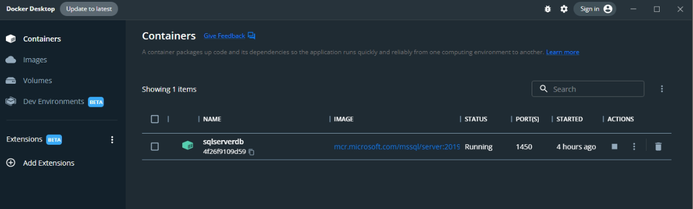
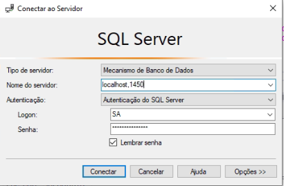
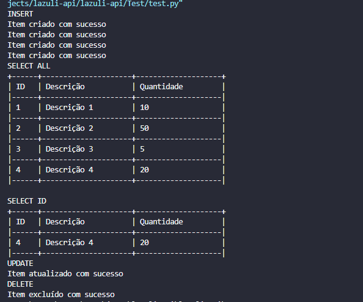

> Como executar o projeto

- Abrir o docker
- Abrir o cmd e executar o comando
```
docker run -e "ACCEPT_EULA=Y" -e "SA_PASSWORD=Numsey#2022" -p 1450:1433 --name sqlserverdb -d mcr.microsoft.com/mssql/server:2019-latest
```
- Verificar se o docker baixou a imagem e o container subiu
<div align="center">
  
</div>

- Abrir o Microsoft SQL Server Management Studio
- Configurar ele como na imagem abaixo, Login: SA e Senha: Numsey#2022
<div align="center">
  
</div>

- Clicar em 'Nova Consulta', colar o script sql abaixo:
```
CREATE DATABASE LZLtech;
GO
Use LZLtech;
GO
CREATE TABLE Produtos
( 
  Id          smallint identity(1,1)
, Descricao   VARCHAR(255) NOT NULL
, Quantidade  INT NOT NULL
, CONSTRAINT pkProdutos PRIMARY KEY (Id)
);
GO
```
- Entrar na pasta Api, abrir o app.py e executar
- Entrar na pasta Test, abrir o test.py e executar
- No fim tem que ter esse resultado abaixo:
<div align="center">
  
</div>
