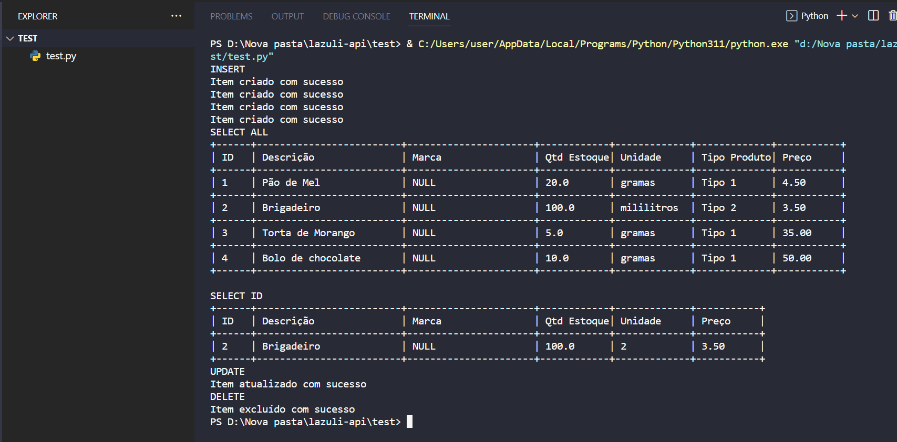

# Lazuli Api

## Requisitos 
#### Python3 - [Clique aqui para o download](https://www.python.org/downloads/)
#### SSMS - [Clique aqui para o download](https://learn.microsoft.com/en-us/sql/ssms/download-sql-server-management-studio-ssms?view=sql-server-ver16)
#### Microsoft ODBC Driver 17 for SQL Server (Opcional) - [Clique aqui para o download](https://learn.microsoft.com/pt-br/sql/connect/odbc/download-odbc-driver-for-sql-server?view=sql-server-ver16)
#### Docker (Opcional) - [Clique aqui para o download](https://www.docker.com/products/docker-desktop/)

<br>

## Build

Abra o SSMS e acesse o seu servidor de banco de dados, na pasta desse projeto em `database` terá um arquivo chamado `create-database.sql` utilize ese script para criar o banco de dados.

```
#clonar repositórios 
git clone <link_repositorios>

#acessar pasta do projeto
cd lazuli-api\app

#instalar dependências do projeto
pip3 install -r requirements.txt

```
Acesse a pasta `lazuli-api\app\config` e configure a string de conexão com o banco de dados de acordo.
```
SQLALCHEMY_DATABASE_URI = "{SGBD}://{usuario}:{senha}@{servidor}/{database}?driver=ODBC+Driver+17+for+SQL+Server".format(
    SGBD = 'mssql+pyodbc',
    usuario = 'SA',
    senha = '123_Mudar',
    servidor = 'localhost,1433',
    database = 'lazuli'
)
```
Acesse a pasta `lazuli-api\app

```
#executar projeto
py.exe .\app.py or python.exe .\app.py

#executar teste
cd lazuli-api\test
py.exe .\test.py or python.exe .\test.py

```

## Utilizando Docker para subir o banco de dados

- Abrir o docker
- Abrir o cmd e executar o comando
```
docker run -e "ACCEPT_EULA=Y" -e "SA_PASSWORD=Numsey#2022" -p 1450:1433 --name sqlserverdb -d mcr.microsoft.com/mssql/server:2019-latest
```
- Verificar se o docker baixou a imagem e o container subiu
<div align="center">
  
</div>

- Abrir o Microsoft SQL Server Management Studio
- Configurar ele como na imagem abaixo, Login: SA e Senha: Numsey#2022
<div align="center">
  
</div>

- Segue os passos no inicio da seção Build

## Resultado do teste:

Para o teste conseguir inserir os registros, é necessario inserir alguns
dados no banco de dados por conta do relacionamento entre as tabelas referente a produtos.
```
USE lazuli
GO
INSERT INTO tipo_produto (descricao)
VALUES ('Tipo 1')
	   ,('Tipo 2')
	   ,('Tipo 3')
	   ,('Ingrediente')
GO
INSERT INTO unidade_medida (descricao, simbolo)
VALUES ('gramas', 'g')
	   ,('mililitros', 'ml')
```
<div align="center">
  
</div>
